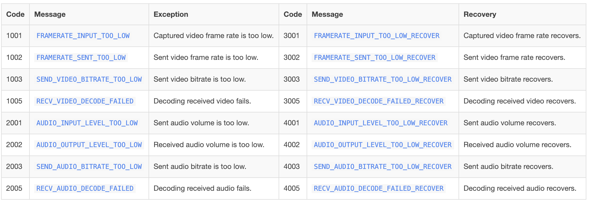

## Introduction
The Agora Web SDK NG provides APIs for you to get the audio and video statistics reflecting the overall quality of a call. The statistics include:
- The statistics of the session.
- The statistics of the local tracks.
- The statistics of the remote tracks.
- The uplink and downlink network conditions of the local user.
- Exception events in the channel.

## Implementation

Before proceeding, ensure that you have implemented the basic real-time communication functions in your project. For details, see [Implement a Basic Video Call](basic_call.md).

### Get the statistics of the session

Call [AgoraRTCClient.getRTCStats](/api/en/interfaces/iagorartcclient.html#getrtcstats) to get the statistics of the session. For the statistics description, see [AgoraRTCStats](/api/en/interfaces/agorartcstats.html).

The `client` object in the following sample code is created by calling `AgoraRTC.createClient`.

```js
const stats = client.getRTCStats();
```

### Get the statistics of local audio and video tracks

Call [LocalAudioTrack.getStats](/api/en/interfaces/ilocalaudiotrack.html#getstats) to get the statistics of a local audio track, and call [LocalVideoTrack.getStats](/api/en/interfaces/ilocalvideotrack.html#getstats) to get the statistics of a local video track. For the statistics description, see [LocalAudioTrackStats](/api/en/interfaces/localaudiotrackstats.html) and [LocalVideoTrackStats](/api/en/interfaces/localvideotrackstats.html).

```js
const audioTrackStats = localAudioTrack.getStats();
const videoTrackStats = localVideoTrack.getStats();
```

### Get the statistics of remote audio and video tracks
Call [RemoteAudioTrack.getStats](/api/en/interfaces/iremoteaudiotrack.html#getstats) to get the statistics of a remote audio track, and call [RemoteVideoTrack.getStats](/api/en/interfaces/iremotevideotrack.html#getstats) to get the statistics of a remote video track. For the statistics description, see [RemoteAudioTrackStats](/api/en/interfaces/remoteaudiotrackstats.html) and [RemoteVideoTrackStats](/api/en/interfaces/remotevideotrackstats.html).

```js
const audioTrackStats = remoteAudioTrack.getStats();
const videoTrackStats = remoteVideoTrack.getStats();
```

### Reports the uplink and downlink network conditions of the local user

After the local user joins the channel, the SDK triggers the [`network-quality`](/api/en/interfaces/iagorartcclient.html#event_network_quality) callback once every two seconds to report the uplink and downlink network conditions of the local user.

- `downlinkNetworkQuality`: The downlink network quality.
- `uplinkNetworkQuality`: The uplink network quality.

**Quality Rating Table**
| Rating | Description |
| -------- | :----------------------------------------------------- |
| 0 | The network quality is unknown. |
| 1 | The network quality is excellent. |
| 2 | The network quality is good, but the bitrate may be slightly lower than optimal. |
| 3 | Users experience slightly impaired communication. |
| 4 | Users cannot communicate smoothly. |
| 5 | The network is so poor that users can barely communicate. |
| 6 | The network is down and users cannot communicate at all. |

``` javascript
client.on("network-quality", (stats) => {
    console.log("downlinkNetworkQuality", stats.downlinkNetworkQuality);
    console.log("uplinkNetworkQuality", stats.uplinkNetworkQuality);
});
```

### Reports exception events in the channel
The SDK reports exception events in the channel by triggering the [`exception`](/api/en/interfaces/iagorartcclient.html#event_exception) callback. Exceptions are not errors, but usually indicate quality issues. This callback also reports recovery from an exception.
- `code`: The event code.
- `msg`: The event message.
- `uid`: The uid of the user who experiences the exception or recovery event.

``` javascript
client.on("exception", function(evt) {
  console.log(evt.code, evt.msg, evt.uid);
})
```

Each exception event has a corresponding recovery event. See the table below for details.



## Considerations
All the above methods must be called after joining the channel.