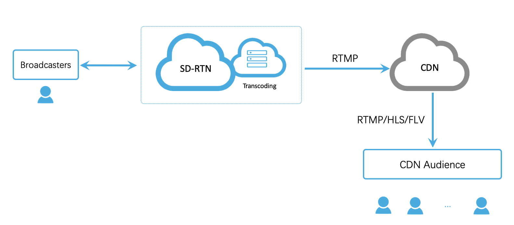
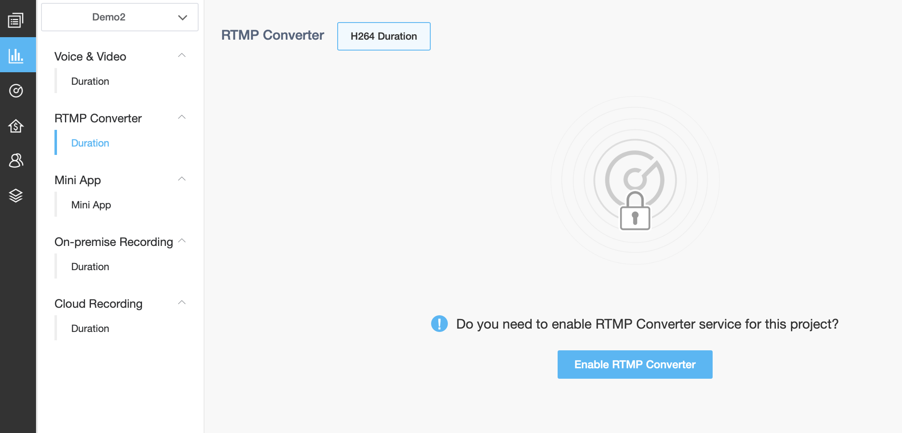

## Introduction

CDN live streaming is the process of publishing streams into the CDN (Content Delivery Network), where users view the live broadcast through a web browser.



When multiple hosts are in a channel in CDN live streaming, [transcoding](https://docs.agora.io/en/Agora%20Platform/terms?platform=All%20Platforms#transcoding) combines the streams of all the hosts into a single stream. Transcoding sets the audio and video profiles and the picture-in-picture layout for the stream to be pushed to the CDN.

> Agora charges a transcoding usage fee for CDN live streaming.

## Prerequisites
Ensure that you enable the RTMP Converter service before using this function.

1. Log in to [Console](https://console.agora.io), and click  in the left navigation menu to go to the **Products & Usage** page.
2. Select a project from the drop-down list in the upper-left corner and click **Duration** under RTMP Converter.

3. Click **Enable RTMP Converter**.
4. Click **Apply** to enable the RTMP Converter service and get a maximum of 500 concurrent channels.

> The number of concurrent channels, N, means that in an Agora project, you push N streams to the CDN with transcoding at the same time.

You can now use the function and view the usage statistics.

## Implementation

Before proceeding, ensure that you have implemented the basic real-time communication functions in your project. For details, see [Implement a Basic Video Call](basic_call.md).

Follow these steps to push streams to the CDN:

1. Before publishing the stream, call `AgoraRTCClient.setLiveTranscoding` for the hosts in the channel to set the configurations for transcoding, such as the resolution, bitrate, frame rate, background color, and watermarks. If you want to manage the layout of multiple hosts in the CDN live streaming, set the `transcodingUsers` parameter, as shown in the following [sample code](#sample-code).

2. Call `AgoraRTCClient.startLiveStreaming` for the hosts in the channel to publish their local stream to a CDN address. Use the `transcodingEnabled` parameter to set whether or not to enable transcoding.

3. Call `AgoraRTCClient.stopLiveStreaming` for the hosts in the channel to remove a CDN address.

### Sample code

The `client` object in the following sample code is created by calling `AgoraRTC.createClient`.

```js
// CDN transcoding configurations.
const LiveTranscoding = {
  // Width of the video (px). The default value is 640.
  width: 640,
  // Height of the video (px). The default value is 360.
  height: 360,
  // Bitrate of the video (Kbps). The default value is 400.
  videoBitrate: 400,
  // Frame rate of the video (fps). The default value is 15.
  videoFramerate: 15,
  audioSampleRate: AgoraRTC.AUDIO_SAMPLE_RATE_48000,
  audioBitrate: 48,
  audioChannels: 1,
  videoGop: 30,
  // Video codec profile. Choose to set as Baseline (66), Main (77), or High (100). If you set this parameter to other values, Agora adjusts it to the default value of 100.
  videoCodecProfile: AgoraRTC.VIDEO_CODEC_PROFILE_HIGH,
  userCount: 1,
  userConfigExtraInfo: {},
  backgroundColor: 0x000000,
  // Add an online PNG watermark image to the video. You can add more than one watermark image at the same time.
  watermark: {
          url: "http://www.com/watermark.png",
          x: 0,
          y: 0,
          width: 160,
          height: 160,
  },
  // Set the layout for each user.
  transcodingUsers: [{
          x: 0,
          y: 0,
          width: 640,
          height: 360,
          zOrder: 0,
          alpha: 1.0,
          // The uid must be identical to the uid used in AgoraRTCClient.join.
          uid: 1232,
  }],
};

// This is an asynchronous method. Please ensure that the asynchronous operation completes before conducting the next operation.
client.setLiveTranscoding(LiveTranscoding).then(() => {
  console.log("set live transcoding success");
});

// Add a URL to which the host pushes a stream. Set the transcodingEnabled parameter as true to enable the transcoding service. Once transcoding is enabled, you need to set the live transcoding configurations by calling setLiveTranscoding. We do not recommend transcoding in the case of a single host.
// This is an asynchronous method. Please ensure that the asynchronous operation completes before conducting the next operation.
client.startLiveStreaming("your RTMP URL", true).then(() => {
  console.log("start live streaming success");
})

// Remove a URL and stop live streaming. This is an asynchronous method. Please ensure that the asynchronous operation completes before conducting the next operation.
client.stopLiveStreaming("your RTMP URL").then(() => {
  console.log("stop live streaming success");
})
```

### API reference
- [`AgoraRTCClient.setLiveTranscoding`](/api/en/interfaces/iagorartcclient.html#setlivetranscoding)
- [`AgoraRTCClient.startLiveStreaming`](/api/en/interfaces/iagorartcclient.html#startlivestreaming)
- [`AgoraRTCClient.stopLiveStreaming`](/api/en/interfaces/iagorartcclient.html#stoplivestreaming)
- [`AgoraRTCClient.on("live-streaming-error")`](/api/en/interfaces/iagorartcclient.html#event_live_streaming_error)
- [`AgoraRTCClient.on("live-streaming-warning")`](/api/en/interfaces/iagorartcclient.html#event_live_streaming_warning)

## Considerations
- A maximum of 17 hosts can be supported in the same live-broadcast channel.
- Set the value of `videoBitrate` according to the [Video Bitrate Table](video_profile.md#recommended-video-profiles). If you set a bitrate beyond the recommended range, the SDK automatically adjusts it to a value within the range.
- To prevent logic errors, Agora suggests using different URLs for CDN live streaming with transcoding and CDN live streaming without transcoding.
- In the case of a single host, Agora does not recommend transcoding. You can skip Step 1, and call `Client.startLiveStreaming` directly with `enableTranscoding` set as `false`. Please use `AgoraRTC.createClient({mode: "live", codec: "h264"})` in this case.