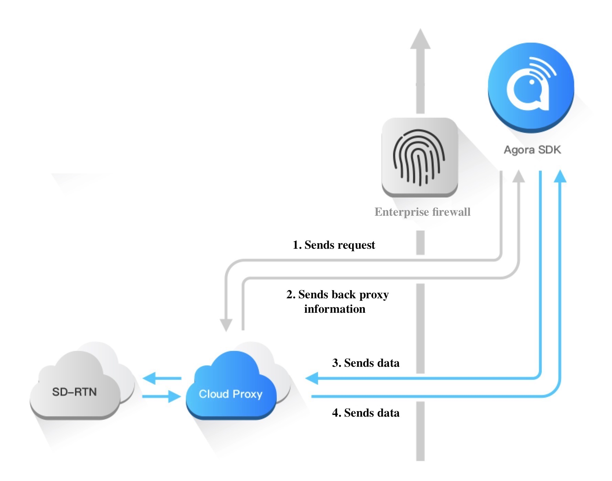

## Introduction
Enterprises with high-security requirements usually have firewalls that restrict employees from visiting unauthorized websites.

To ensure that enterprise users can connect to Agora's services through a firewall, Agora provides a cloud proxy service.

Compared with a single proxy server, a cloud proxy service is more flexible and stable. It is widely implemented in organizations with high-security requirements, such as large-scale enterprises, hospitals, universities, and banks.

## Working principles

The following figure shows the working principles of the Agora cloud proxy service.



1. Before connecting to Agora SD-RTN™, the SDK sends the request to the cloud proxy service.
2. The cloud proxy service sends back the proxy information.
3. The SDK sends the data to the cloud proxy service, and the cloud proxy service forwards the data to Agora SD-RTN™.
4. Agora SD-RTN™ sends the data to the cloud proxy service, and the cloud proxy service forwards the data to the SDK.

## Implementation

Before proceeding, ensure that you have implemented the basic real-time communication functions in your project. For details, see [Implement a Basic Video Call](basic_call.md).

Follow these steps to set up a cloud proxy service:
1. Contact sales-us@agora.io with the following information to enable the cloud proxy service:
  - The regions to use cloud proxy.
  - The scale of your app in terms of channel concurrency.
  - Your Internet service provider.
2. Add the following test IP addresses and ports to your whitelist.
    The sources are the clients that integrate the Agora Web SDK NG.

    | Protocol | Destination | Port | Port Purpose |
    | ---- | -------------- | ------------------------ | ----------------------------- |
    | TCP | 23.236.115.138 | 443, 4000<br/>3433 - 3460 | Message data transmission<br/>Media data exchange |
    | TCP | 148.153.66.218 | 443, 4000<br/>3433 - 3460 | Message data transmission<br/>Media data exchange |
    | TCP | 47.74.211.17 | 443 | Edge node communication |
    | TCP | 52.80.192.229 | 443 | Edge node communication |
    | TCP | 52.52.84.170 | 443 | Edge node communication |
    | TCP | 47.96.234.219 | 443 | Edge node communication |
    | UDP | 23.236.115.138 | 3478 - 3500 | Media data exchange |
    | UDP | 148.153.66.218 | 3478 - 3500 | Media data exchange |

    > These IPs are for testing only. You need to apply for exclusive IP resources for a production environment.

3. Call `AgoraRTCClient.startProxyServer` before joining a channel to enable the cloud proxy service and check if the audio or video call works.

4. Agora provides the IP addresses and ports for you to use the cloud proxy service in a production environment. Add the IP address and ports to your whitelist.

5. If you want to disable the cloud proxy service, call `AgoraRTCClient.stopProxyServer` after leaving the channel.

### Sample code

**Enable the cloud proxy service**

```js
const client = AgoraRTC.createClient({mode: 'live',codec: 'vp8'});

// Enable the cloud proxy service.
client.startProxyServer();
// Join a channel.
client.join("<YOUR TOKEN>", "<YOUR CHANNEL>").then(() => {
  /** ... **/
});
```

**Disable the cloud proxy**

```js
// Enable the cloud proxy service and join a channel.
/** ... **/

// Leave the channel.
client.leave();

// Disable the cloud proxy service.
client.stopProxyServer();

// Rejoin a channel.
client.join("<YOUR TOKEN>", "<YOUR CHANNEL>").then(() => {
  /** ... **/
});
```

### API reference
- [`startProxyServer`](/api/en/interfaces/iagorartcclient.html#startproxyserver)
- [`stopProxyServer`](/api/en/interfaces/iagorartcclient.html#stopproxyserver)

## Considerations

`startProxyServer` must be called before joining the channel, and `stopProxyServer` must be called after leaving the channel.