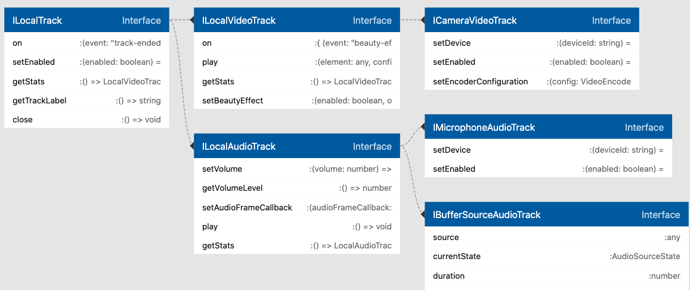

## Overview

This article covers how to use the Agora Web SDK NG to create local audio and video tracks. Before getting into the specific APIs, you need to understand the design details of the local track objects.

The SDK uses an object-oriented design pattern. It uses [LocalTrack](/api/en/interfaces/ilocaltrack.html), a basic abstract class to describe all local track objects, and defines the common methods and behaviors of local track objects. All local track objects inherit from `LocalTrack`.

The `publish` method requires that the published object be `LocalTrack`, so no matter how the local track object is created, it meets the parameter requirements of the `publish` method.

Based on `LocalTrack`, the SDK defines [LocalAudioTrack](/api/en/interfaces/ilocalaudiotrack.html) and [LocalVideoTrack](/api/en/interfaces/ilocalvideotrack.html), which represent local audio track objects and local video track objects respectively. These two classes add methods for specific audio and video characteristics. For example, `LocalAudioTrack` adds methods for getting and controlling volume, and `LocalVideoTrack` adds methods for setting beauty effects.

The SDK provides higher-level local track classes based on `LocalAudioTrack` and `LocalVideoTrack` for additional application scenarios and creation methods. For example, `CameraVideoTrack` is inherited from `LocalVideoTrack`, and indicates that a local video track comes directly from a device's camera. This class adds methods for controlling the camera and adjusting the resolution..

The following figure shows the relationship between these classes:



## Create tracks

The SDK supports the creation of local track objects in the following ways.

### Use the microphone and camera

The most commonly used way is to create a local track object directly through the audio and video captured by the microphone or camera. The SDK provides three methods:

- [createCameraVideoTrack](/api/en/interfaces/iagorartc.html#createcameravideotrack): Uses the video captured by the camera to create a local video track and return a [CameraVideoTrack](/api/en/interfaces/icameravideotrack.html) object.
- [createMicrophoneAudioTrack](/api/en/interfaces/iagorartc.html#createmicrophoneaudiotrack): Uses the audio sampled by the microphone to create a local audio track and return a [MicrophoneAudioTrack](/api/en/interfaces/imicrophoneaudiotrack.html) object.
- [createMicrophoneAndCameraTracks](/api/en/interfaces/iagorartc.html#createmicrophoneandcameratracks): Creates a local track using the audio and video captured by the microphone and camera at the same time, and return a list containing [CameraVideoTrack](/api/en/interfaces/icameravideotrack.html) and of [MicrophoneAudioTrack](/api/en/interfaces/imicrophoneaudiotrack.html).

> When using `createMicrophoneAndCameraTracks` to create a local track, if either the camera or microphone cannot complete the capture, the entire capture fails, and the SDK throws an error. This is because the audio and video capture is done at the same time, For details, see [Error handling](#error). If you call `createCameraVideoTrack` and `createMicrophoneAudioTrack` separately, the failure of one of them does not affect the other. Please choose the appropriate method according to your needs.

```js
// Capture the video from the camera
const cameraTrack = await AgoraRTC.createCameraVideoTrack();

// Sample the audio from the microphone
const microphoneTrack = await AgoraRTC.createMicrophoneAudioTrack();

// Capture and audio and video at one time
const [microphoneTrack, cameraTrack] = await AgoraRTC.createMicrophoneAndCameraTracks();
```

When calling these methods, you can pass in a configuration parameter to control the capture behavior. For detailed parameter definitions, see [CameraVideoTrackInitConfig](/api/en/interfaces/cameravideotrackinitconfig.html) or [MicrophoneAudioTrackInitConfig](/api/en/interfaces/microphoneaudiotrackinitconfig.html).

> These methods are all asynchronous and need to be used with `async/await` or `Promise`.

### Use the screen

The SDK provides the [createScreenVideoTrack](/api/en/interfaces/iagorartc.html#createscreenvideotrack) method to create a screen-sharing track. This method returns the `LocalVideoTrack` object. Because `LocalVideoTrack` only implements the basic methods of the video track object, the track created from the screen cannot control the resolution or switch devices like a camera track.

```js
const screenTrack = await AgoraRTC.createScreenVideoTrack();
```

> This method is asynchronous and needs to be used with `async/await` or `Promise`.

To share a screen on Electron or older versions of Chrome, or to share audio when sharing your screen, see [Screen Sharing](screensharing.md).

### Use a local or online audio file

The SDK provides the [createBufferSourceAudioTrack](/api/en/interfaces/iagorartc.html#createbuffersourceaudiotrack) method to create a local audio track object from a local or online audio file. This method creates a `BufferSourceAudioTrack` object, which inherits from `LocalAudioTrack`, and adds methods to control the playback behavior of audio files, such as pausing, skipping, or looping playback.

You can use this method for audio mixing or playing audio effects, see [Play Audio Effects/Audio Mixing](audio_effect_mixing.md) for details.

> This method is asynchronous and needs to be used with `async/await` or `Promise`.

```js
const audioFileTrack = await AgoraRTC.createBufferSourceAudioTrack({
  source: "https://web-demos-static.agora.io/agora/smlt.flac",
});

// Read the audio file before playback
audioFileTrack.startProcessAudioBuffer();

audioFileTrack.play();
```

### Use a custom method

If you are familiar with WebRTC or [MediaStreamTrack](https://developer.mozilla.org/en-US/docs/Web/API/MediaStreamTrack) related APIs, you can create a `MediaStreamTrack` object by implementing the capture by yourself, and then use [createCustomAudioTrack](/api/en/interfaces/iagorartc.html#createcustomaudiotrack) or [createCustomVideoTrack](/api/en/interfaces/iagorartc.html#createcustomvideotrack) to convert the `MediaStreamTrack` object into the `LocalAudioTrack` or `LocalVideoTrack` object in the SDK.

```js
// Get a `MediaStreamTrack` object by custom capture
const customMediaStreamTrack = getMediaStreamTrackFromXXX(/* .. */);

// Create a custom video track
const customTrack = AgoraRTC.createCustomVideoTrack({
  mediaStreamTrack: customMediaStreamTrack,
});
```

## Enable/Disable local tracks

After creating a local track object, to turn off the microphone or camera temporarily, you can disable the track. The SDK provides the [LocalTrack.setEnabled](/api/en/interfaces/ilocaltrack.html#setenabled) method to enable or disable the local track object.

> This method is asynchronous and needs to be used with async/await or Promise.

After you call `setEnabled(true)` to disable a local track, the track stops local playback. If the track is published, publishing stops and remote users receive the `user-unpublished` callback; after you call `setEnabled(true)`, the SDK automatically re-publishes the track.

Based on the type of the local track, the behaviors vary after the method call of `setEnabled`:

- Local tracks created by device capture (`CameraVideoTrack`/`MicrophoneAudioTrack`): After you call `setEnabled(false)`, the capture stops and the capture device is released. If the camera or microphone has an indicator light, the light turns off. After you call `setEnabled(true)`, the capture automatically resumes.
- Local tracks created by other methods: After you call `setEnabled(false)`, the SDK encodes black frames for video tracks and silenced audio frames for audio tracks by default. After you call `setEnabled(true)`, the SDK automatically resumes normal encoding.

```js
const videoTrack = await AgoraRTC.createCameraVideoTrack();

// Temporarily turn off the camera captrue
await videoTrack.setEnabled(false);

// ...

// Resumes the camera capture
await videoTrack.setEnabled(true);
```

## <a name="error"></a>Error handling

When creating local audio and video tracks, the SDK may throw the following errors due to the differences between devices and browsers.

- `NOT_SUPPORTED`: The function used is not supported by the current browser.
- `MEDIA_OPTION_INVALID`: The specified capture configurations cannot be satisfied, usually because the device does not support the specified resolution or frame rate.
- `DEVICE_NOT_FOUND`: The specified capture device cannot be found.
- `PERMISSION_DENIED`: The user refuses to grant permission to access the camera or microphone. Or, when selecting a sharing source for screen sharing, the user closes the selection window.
- `CONSTRAINT_NOT_SATISFIED`: The browser does not support the specified capture configurations.
- `SHARE_AUDIO_NOT_ALLOWED`: The user does not check **Share Audio** when sharing audio with screen sharing.