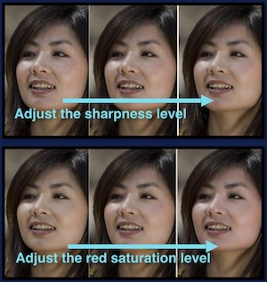

## Introduction

Agora provides an image enhancement API for users in social and entertainment scenarios to improve their appearance in video calls or live broadcasts. With this API, users can adjust settings such as the image contrast, brightness, sharpness, and red saturation, as shown in the following figure:



## Implementation

Before enabling image enhancement, ensure that you have implemented the basic real-time communication functions in your project. For details, see [Implement a Basic Video Call](basic_call.md).

Call [setBeautyEffect](/api/en/interfaces/ilocalvideotrack.html#setbeautyeffect) method in [LocalVideoTrack](/api/cn/interfaces/ilocalvideotrack.html) to enable image enhancement.
> This method supports the following browsers:
> - Safari 12 or later
> - Chrome 65 or later
> - Firefox 70.0.1 or later

This method has two parameters:

- `enabled`: Sets whether to enable image enhancement.
- `options`: Sets the image enhancement options, including:
  - `lighteningContrastLevel` for adjusting the contrast level.
  - `lighteningLevel` for adjusting the brightness level.
  - `smoothnessLevel` for adjusting the sharpness level.
  - `rednessLevel` for adjusting the red saturation level.

### Sample code

The `localVideoTrack` object in the following sample code is created by calling `AgoraRTC.createCameraVideoTrack`.

```js
localVideoTrack.setBeautyEffect(true, {
    lighteningContrastLevel: 1,
    lighteningLevel: 0.7,
    smoothnessLevel: 0.5,
    rednessLevel: 0.1
}).then(() => { console.log("set Beauty Effect Options success!") });
```

### API Reference

- [`setBeautyEffect`](/api/en/interfaces/ilocalvideotrack.html#setbeautyeffect)

## Considerations
- This function is not supported on mobile devices.
- The image enhancement function involves real-time compute-intensive processing. Though it is based on hardware acceleration, the processing has high GPU and CPU overheads. For low-end devices, enabling image enhancement affects the system performance. When the video resolution is set as 360p, 720p or higher, and the frame rate is set as 30 fps or 15 fps, do not enable image enhancement.