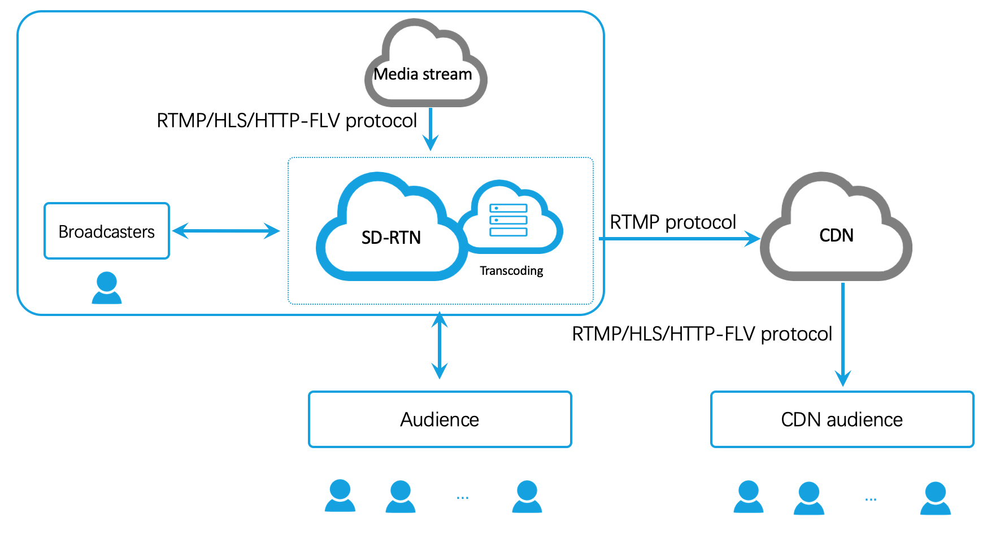

## Introduction
Injecting an online media stream is the action of adding an external audio or video stream to an ongoing live-broadcast channel. It enables the hosts and audience in the channel to see and hear the additional stream while interacting with each other.

### Applicable scenarios
- Live sports: The host and audience can watch and simultaneously comment on events.
- Music concerts, movies, and other performances: The host and audience can participate in real-time discussions while watching them.
- Additional perspectives: The host can inject video streams captured by drones or network cameras into a live broadcast.

### Working principles



The host in a live-broadcast channel pulls an online media stream and pushes it through the Video Inject Server to the Agora SD-RTN™ and the channel.

- The host and audience in the channel can see and hear the media stream.
- If the host enables Content Delivery Network (CDN) live streaming, the injected media stream is also pushed to the CDN so that the CDN audience can see and hear the media stream.

> - Only one online media stream can be injected into the same channel at the same time.
> - Supported codec types: AAC for audio, and H.264 for video.
> - Audio-only streams are also supported.
> - Only the host can inject and remove an injected media stream. Neither the co-host nor the audience can do that.

## Implementation

Before proceeding, ensure that you have implemented the basic real-time communication functions in your project. For details, see [Implement a Basic Video Call](basic_call.md).

> Ensure that you enable the RTMP Converter service before using this function. See [Prerequisites](cdn_streaming.md#prerequisites).

Follow these steps to inject an online media stream:
1. The host in the channel calls `AgoraRTCClient.addInjectStreamUrl` to inject an online media stream to the live-broadcast channel. You can modify the parameter values of `config` to set the resolution, bitrate, and frame rate of the injected stream. See [InjectStreamConfig](/api/en/interfaces/injectstreamconfig.html).

> - You can inject only one online media stream into a channel at the same time.
> - If the method call succeeds, this stream is added to the channel, and the SDK triggers the `AgoraRTCClient.on("user-joined")` and `AgoraRTCClient.on("user-published")` callbacks to all the users in the channel.

2. The hosts in the channel call `AgoraRTCClient.removeInjectStreamUrl` to remove the injected media stream.

> - If the method call is successful, the SDK triggers the `AgoraRTCClient.on("user-unpublished")` and `AgoraRTCClient.on("user-left")` callbacks to all the users in the channel.
> - You do not need to call `removeInjectStreamUrl` if the host has left the channel.

### Sample code
The `client` object in the following sample code is created by calling `AgoraRTC.createClient`.

```js
const injectStreamConfig = {
  width: 0,
  height: 0,
  videoGop: 30,
  videoFramerate: 15,
  videoBitrate: 400,
  audioSampleRate: 44100,
  audioChannels: 1,
};

// Inject an online media stream.
client.addInjectStreamUrl("<YOUR URL>", injectStreamConfig).then(() => {
  console.log("add inject stream url success");
}).catch(e => {
  console.log("add inject stream failed", e);
});

client.removeInjectStreamUrl().then(() => {
  console.log("remove inject stream url success");
}).catch(e => {
  console.log("remove inject stream failed", e);
});
```

### API reference
- [`AgoraRTCClient.addInjectStreamUrl`](/api/en/interfaces/iagorartcclient.html#addinjectstreamurl)
- [`AgoraRTCClient.removeInjectStreamUrl`](/api/en/interfaces/iagorartcclient.html#removeinjectstreamurl)

## Considerations
To receive the injected media stream, the audience need to subscribe to the host.