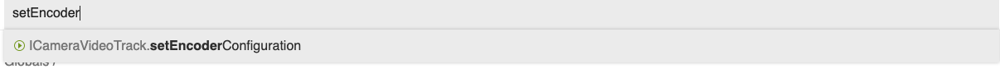

This guide helps developers who have implemented the [Agora Web SDK](https://docs.agora.io/en/Video/start_call_web?platform=Web) in their apps to migrate from the Agora Web SDK to the Agora Web SDK NG.

This guide covers the following topics:
- [Changes in SDK behaviors and API methods](#changes-in-sdk-behaviors-and-api-methods): Lists the significant changes between the Agora Web SDK NG and the Agora Web SDK in SDK behaviors and methods.
- [Migration examples](#migration-examples): Introduces the differences between implementing the Agora Web SDK NG and the Agora Web SDK in detail, using the example of building a video conferencing app.
- [API Change List](#api-change-list): Provides a complete API change list for your reference.

Agora recommends you read [Changes in SDK behaviors and API methods](#changes-in-sdk-behaviors-and-api-methods) and [Migration examples](#migration-examples) to get a basic understanding of the differences between the Agora Web SDK and the Agora Web SDK NG. To explore a specific issue during the migration, you can:
- Refer to [API Change List](#api-change-list).
- Read the [advanced guides](screensharing.md) for advanced features, such as sharing the screen and pushing streams to CDN.
- Read the [API reference](https://agoraio-community.github.io/AgoraWebSDK-NG/api/en/). Search for a specific API by name to see the function signature.



> The Agora Web SDK NG **is not backward compatible**, which means that migration may take considerable effort. Agora has replaced all callbacks with `Promise` in the Agora Web SDK NG, requiring a change in the implementation of more than 70% of the API methods. You also need to take note of the changes in infrastructure and logic.

## Changes in SDK behaviors and API methods

### Use promises for asynchronous operations
For asynchronous methods such as joining and leaving a channel, publishing and subscribing, enumerating media input devices, and starting and stopping live transcoding, the Agora Web SDK notifies users of the results of these asynchronous operations with callbacks or events, while the Agora Web SDK NG uses promises.

### Fine control over audio and video tracks

For the Agora Web SDK NG, we replace the [Stream](https://docs.agora.io/en/Video/API%20Reference/web/interfaces/agorartc.stream.html) object with `Track` objects. You create, publish, or subscribe to one or multiple audio and video tracks. Tracks make up a stream. The advantage of dividing a stream up into tracks is that audio and video are controllable separately. And these new methods are easier to use than the `Stream.addTrack` and ` Stream.removeTrack` methods in the Agora Web SDK.

> For now, the Agora Web SDK NG allows publishing multiple audio tracks but only one video track. The SDK automatically mixes multiple audio tracks into one when publishing.

In addition to replacing the `Stream` object with ` Track` objects, the Agora Web SDK NG provides different interfaces for the local and remote tracks. Some methods and objects are only available locally, and some are only available remotely.

This change affects multiple API methods, including creating objects, publishing, and subscribing to tracks. For details, see [Creating an audio track and a video track](#create-an-audio-track-and-a-video-track) and [Publish the local audio and video tracks](#publish-the-local-audio-and-video-tracks).

### Improve channel events

#### Rename events

In the Agora Web SDK NG, we ensure the consistency of all event names. For example, Agora renames `onTokenPrivilegeWillExpire` as `token-privilege-will-expire`. Agora also renames several events to ensure developers can better understand how they work. For example, Agora renames `peer-online` and `peer-offline` as `user-joined` and `user-left`, `stream-added` and `stream-removed` as `user-published` and `user-unpublished`. For details, see [API Change List](#api-change-list).

#### Change the format of parameters in events

In the Agora Web SDK, the parameters of events must be wrapped in an object, while in the Agora Web SDK NG, you can directly pass multiple parameters in events.

Take the `"connection-state-change"` event as an example:

```js
// Use the Agora Web SDK
client.on("connection-state-change", e => {
  console.log("current", e.curState, "prev", e.prevState);
});
```

```js
// Use the Agora Web SDK NG
client.on("connection-state-change", (curState, prevState) => {
  console.log("current", curState, "prev", prevState);
});
```

#### Improve the event notification mechanism

The Agora Web SDK NG improves its event notification mechanism, and **does not trigger channel events repeatedly**.

For example, assume that a **local user A** and **remote users B, C, and D** joins a channel at the same time, and B, C, and D all publishes their streams. If A suddenly loses connection with the channel due to bad network conditions, the SDK automatically reconnects A to the channel. **While A is reconnecting to the channel, B leaves the channel and C unpublishes the stream**. My question is, what events that the SDK triggers during the whole process?

When A joins the channel, the Agora Web SDK and Agora Web SDK NG trigger the same events:
- Events indicating B, C, D joining the channel.
- Events indicating B, C, D publishing their streams.

When A loses connection with the channel due to poor network conditions and reconnects to the channel:

- If A uses the Agora Web SDK: When A loses connection with the channel due to poor network conditions, the SDK assumes A has left the channel and clears all the states in the channel. When A successfully reconnects to the channel, it receives:
  - Events indicating C, D joining the channel.
  - Events indicating D publishing the stream.
> In the Agora Web SDK, you can expect to receive the same events multiple times due to disconnection and reconnection, which may cause unexpected problems for dealing with these events on the app level. You need to listen for connection state changes and reset the states on the app level to avoid unexpected problems when receiving these events for the second time.
- If A uses the Agora Web SDK NG, when A loses connection with the channel due to poor network conditions, the SDK assumes that A is still in the channel and does not clear all the states in the channel. When A successfully reconnects to the channel, the SDK only sends A events that are lost during the reconnection process, including:
  - The event indicating B leaving the channel.
  - The event indicating C unpublishing the stream.
> The Agora Web SDK NG does not send you the same events repeatedly and ensures your app works properly during reconnection.

As these hypothetical examples demonstrate, the event notification mechanism in the Agora Web SDK NG is more intuitive and does not need extra work.

## Migration examples

This section takes building a video conferencing app as an example and introduces the differences between implementing the Agora Web SDK NG and the Agora Web SDK in detail.

### Join a channel
First, create a `Client` object and join a specified channel.

```js
// Use the Agora Web SDK
const client = AgoraRTC.createClient({ mode: "live", codec: "vp8" });
client.init("APPID", () => {
  client.join("Token", "Channel", null, (uid) => {
    console.log("join success", uid);
  }, (e) => {
    console.log("join failed", e);
  });
});
```

```js
// Use the Agora Web SDK NG
const client = AgoraRTC.createClient({ mode: "live", codec: "vp8" });

try {
  const uid = await client.join("APPID", "Token", "Channel", null);
  console.log("join success");
} catch (e) {
  console.log("join failed", e);
}
```
> Here we assume that our code runs within in an `async` function and use `await` in the following code snippets.

Key points:
- In the Agora Web SDK NG, we use the `Promise` object together with `async/await` for the asynchronous operation `join`.
- The Agora Web SDK NG removes the `client.init` method and you pass `APPID` when calling `client.join`. If you want to join another channel that uses a different App ID, you do not need to create another client object.

### Create an audio track and a video track
Second, create an audio track object from the audio sampled by a microphone and create a local video track from the video captured by a camera. In the sample code, by default, we play the local video track and do not play the local audio track.

```js
// Use Agora Web SDK
const localStream = AgoraRTC.createStream({ audio: true, video: true });
localStream.init(() => {
  console.log("init stream success");
  localStream.play("DOM_ELEMENT_ID", { muted: true });
}, (e) => {
  console.log("init local stream failed", e);
});
```

```js
// Use Agora Web SDK NG
const localAudio = await AgoraRTC.createMicrophoneAudioTrack();
const localVideo = await AgoraRTC.createCameraVideoTrack();
console.log("create local audio/video track success");

localVideo.play("DOM_ELEMENT_ID");
```

Key points:
- The Agora Web SDK NG removes the `Stream` object. Call `createMicrophoneAudioTrack` to create an audio track and call `createCameraVideoTrack` to create a video track.
- The audio and video track objects in the Agora Web SDK NG do not provide the `init` method because the SDK initializes the microphone and camera when creating the tracks and notifies you of the result with promises.
- The Agora Web SDK NG can control the playback of local audio and video tracks separately and removes the `muted` parameter in the `play` method. If you do not want to play the local audio track, do not call `play` in the local audio track object.

### Publish the local audio and video tracks
After creating the local audio and video tracks, publish these tracks to the channel.

```js
// Use the Agora Web SDK
client.publish(localStream, err => {
  console.log("publish failed", err);
});
client.on("stream-published",  () => {
  console.log("publish success");
});
```

```js
// Use the Agora Web SDK NG
try {
  // Remove this line if the channel profile is not live broadcast.
  await client.setClientRole("host");
  await client.publish([localAudio, localVideo]);
  console.log("publish success");
} catch (e) {
  console.log("publish failed", e);
}
```

Key points:
- If your channel profile is [live broadcast](/api/en/interfaces/clientconfig.html#mode), the Agora Web SDK automatically sets the user role as `host` when publishing the stream. However, in the Agora Web SDK NG, you need to call `setClientRole` to set the user role as `host`.
- In the Agora Web SDK NG, `publish` returns a `Promise` object representing the eventual completion or failure of the asynchronous operation.
- In the Agora Web SDK NG, when calling `publish`, you need to pass one or multiple `LocalTrack` objects instead of the `Stream` object. You can call `publish` repeatedly to publish multiple tracks and call `unpublish` repeatedly to unpublish multiple tracks.

### Subscribe to remote media tracks and play

When a remote user in the channel publishes media tracks, we need to automatically subscribe to these tracks and play. To do this, you need to listen for the `user-published` event and call `subscribe` when the SDK triggers this event.

```js
// Use the Agora Web SDK
client.on("stream-added", e => {
  client.subscribe(e.stream, { audio: true, video: true }, err => {
    console.log("subscribe failed", err);
  });
});

client.on("stream-subscribed", e => {
  console.log("subscribe success");
  e.stream.play("DOM_ELEMENT_ID");
});
```

```js
// Use the Agora Web SDK NG
client.on("user-published", async (remoteUser, mediaType) => {
  await client.subscribe(remoteUser, mediaType);
  if (mediaType === "video") {
    console.log("subscribe video success");
    remoteUser.videoTrack.play("DOM_ELEMENT_ID");
  }
  if (mediaType === "audio") {
    console.log("subscribe audio success");
    remoteUser.audioTrack.play();
  }
});
```

Key points:
- The Agora Web SDK NG replaces the `stream-added`, `stream-removed`, and `stream-updated` events with the `user-published` and `user-unpublished` events.
> Pay attention to the `mediaType` parameter of the `user-published` event, which marks the type of the current track the remote user publishes. It can be `"video"` or `"audio"`. If the remote user publishes an audio track and a video track at the same time, the SDK triggers two `user-published` events, in which `mediaType` is `"audio"` and `"video"` respectively.

- In the Agora Web SDK NG, `subscribe` returns a `Promise` object representing the eventual completion or failure of the asynchronous operation. When calling `subscribe`, pass a `remoteUser` object. For details, see [AgoraRTCRemoteUser](/api/en/interfaces/iagorartcremoteuser.html).
- When the subscription succeeds, the subscribed tracks are updated to `remoteUser` and you can go on to call `play`.

## API change list
### AgoraRTC
- Rename `getScreenSources` as [getElectronScreenSources](/api/en/interfaces/iagorartc.html#getelectronscreensources), remove callbacks, and return a promise
- [getDevices](/api/en/interfaces/iagorartc.html#getdevices) returns a promise. Add [getCameras](/api/en/interfaces/iagorartc.html#getcameras) and [getMicrophones](/api/en/interfaces/iagorartc.html#getmicrophones)
- Remove the `Logger` object, and add [disableLogUpload](/api/en/interfaces/iagorartc.html#disablelogupload), [enableLogUpload](/api/en/interfaces/iagorartc.html#enablelogupload), and [setLogLevel](/api/en/interfaces/iagorartc.html#setloglevel)
- Replace `createStream` with the following methods:
  - [createMicrophoneAudioTrack](/api/en/interfaces/iagorartc.html#createmicrophoneaudiotrack)
  - [createCameraVideoTrack](/api/en/interfaces/iagorartc.html#createcameravideotrack)
  - [createScreenVideoTrack](/api/en/interfaces/iagorartc.html#createscreenvideotrack)
  - [createBufferSourceAudioTrack](/api/en/interfaces/iagorartc.html#createbuffersourceaudiotrack)
  - [createCustomAudioTrack](/api/en/interfaces/iagorartc.html#createcustomaudiotrack)
  - [createCustomVideoTrack](/api/en/interfaces/iagorartc.html#createcustomvideotrack)

### Client
- Remove `Client.init`
- Remove `Client.getConnectionState` and add [Client.connectionState](/api/en/interfaces/iagorartcclient.html#connectionstate)
- Add `RECONNECTING` in [ConnectionState](/api/en/globals.html#connectionstate)
- Add [Client.uid](/api/en/interfaces/iagorartcclient.html#uid)
- Add [Client.remoteUsers](/api/en/interfaces/iagorartcclient.html#remoteusers)
- [Client.addInjectStreamUrl](/api/en/interfaces/iagorartcclient.html#addinjectstreamurl) returns a promise representing the success or failure of injecting the stream.Remove `Client.on("streamInjectStatus")`.
- Remove the `url` parameter in [Client.removeInjectStreamUrl](/api/en/interfaces/iagorartcclient.html#addinjectstreamurl)
- Remove the callbacks of [Client.enableDualStream](/api/en/interfaces/iagorartcclient.html#enabledualstream) / [Client.disableDualStream](/api/en/interfaces/iagorartcclient.html#disabledualstream) and return a promise
- Move `Client.getCameras`, `Client.getDevices`, `Client.getRecordingDevices` to the `AgoraRTC` interface
- Remove `Client.getPlayoutDevices`
- Replace `Client.getLocalAudioStats`, `Client.getLocalVideoStats`, `Client.getRemoteAudioStats`, and `Client.getRemoteVideoStats` with [LocalAudioTrack.getStats](/api/en/interfaces/ilocalaudiotrack.html#getstats), [LocalVideoTrack.getStats](/api/en/interfaces/ilocalvideotrack.html#getstats), [RemoteAudioTrack.getStats](/api/en/interfaces/iremoteaudiotrack.html#getstats), and [RemoteVideoTrack.getStats](/api/en/interfaces/iremotevideotrack.html#getstats).
- Remove `Client.getSystemStats`
- Replace `Client.getSessionStats` and `Client.getTransportStats` with [Client.getRTCStats](/api/en/interfaces/iagorartcclient.html#getrtcstats)
- Remove the callback in [Client.join](/api/en/interfaces/iagorartcclient.html#join) and return a promise. Also add the `appid` parameter in this method
- Remove the callback in [Client.leave](/api/en/interfaces/iagorartcclient.html#leave) and return a promise.
- Add [Client.once](/api/en/interfaces/iagorartcclient.html#once)
- Add [Client.removeAllListeners](/api/en/interfaces/iagorartcclient.html#removealllisteners)
- Add the `tracks` parameter in [Client.publish](/api/en/interfaces/iagorartcclient.html#publish) for passing [LocalTrack](/api/en/interfaces/ilocaltrack.html). This method returns a promise. Remove `Client.on("stream-published")`
- [Client.unpublish](/api/en/interfaces/iagorartcclient.html#publish) returns a promise.
- Add the `user` parameter in [Client.subscribe](/api/en/interfaces/iagorartcclient.html#subscribe) for passing [AgoraRTCRemoteUser](/api/en/interfaces/iagorartcremoteuser.html)，This method returns a promise. Remove `Client.on("stream-subscribed")`.
- Add the `user` parameter in [Client.unsubscribe](/api/en/interfaces/iagorartcclient.html#unsubscribe) for passing [AgoraRTCRemoteUser](/api/en/interfaces/iagorartcremoteuser.html). This method returns a promise.
- [Client.renewToken](/api/en/interfaces/iagorartcclient.html#renewtoken) returns a promise.
- Remove the callback in [Client.setClientRole](/api/en/interfaces/iagorartcclient.html#setclientrole) and return a promise. In the Agora Web SDK NG, **setting the user role as `audience` does not unpublish, and when calling `publish`, the SDK does not automatically setting the user role as `host`**
- Replace `Client.setEncryptionMode` and `Client.setEncryptionSecret` with [Client.setEncryptionConfig](/api/en/interfaces/iagorartcclient.html#setencryptionconfig)
- [Client.setLiveTranscoding](/api/en/interfaces/iagorartcclient.html#setlivetranscoding), [Client.startLiveStreaming](/api/en/interfaces/iagorartcclient.html#startlivestreaming), and [Client.stopLiveStreaming](/api/en/interfaces/iagorartcclient.html#stoplivestreaming) all return a promise. Remove `Client.on("liveTranscodingUpdated")`, `Client.on("liveStreamingStarted")`, `Client.on("liveStreamingFailed")`, and `Client.on("liveStreamingStopped")` events.
- [Client.startChannelMediaRelay](/api/en/interfaces/iagorartcclient.html#startchannelmediarelay) return a promise
  - Replace `setDestChannelInfo` in [ChannelMediaRelayConfiguration](/api/en/interfaces/ichannelmediarelayconfiguration.html) with [addDestChannelInfo](/api/en/interfaces/ichannelmediarelayconfiguration.html#adddestchannelinfo), remove several parameters
  - Remove several parameters in [setSrcChannelInfo](/api/en/interfaces/ichannelmediarelayconfiguration.html#setsrcchannelinfo) of [ChannelMediaRelayConfiguration](/api/en/interfaces/ichannelmediarelayconfiguration.html)
- [Client.stopChannelMediaRelay](/api/en/interfaces/iagorartcclient.html#stopchannelmediarelay) return a promise
- Remove the callback in [Client.updateChannelMediaRelay](/api/en/interfaces/iagorartcclient.html#updatechannelmediarelay) and this method returns a promise.
- Replace `Client.on("first-video-frame-decode")` and `Client.on("first-audio-frame-decode")` with [RemoteTrack.on("first-frame-decode")](/api/en/interfaces/iremotetrack.html#event_first_frame_decoded)
- Replace `Client.on("mute-audio")`, `Client.on("mute-video")`, `Client.on("unmute-audio")`, and `Client.on("unmute-video")` with [Client.on("user-mute-updated")](/api/en/interfaces/iagorartcclient.html#event_user_mute_updated)
- Replace `Client.on("active-speaker")` with [Client.on("volume-indicator")](/api/en/interfaces/iagorartcclient.html#event_volume_indicator)
- Rename `Client.on("onTokenPrivilegeWillExpire")` and `Client.on("onTokenPrivilegeDidExpire")` as [Client.on("token-privilege-will-expire")](/api/en/interfaces/iagorartcclient.html#event_token_privilege_will_expire) and [Client.on("token-privilege-did-expire")](/api/en/interfaces/iagorartcclient.html#event_token_privilege_did_expire)
- Remove `Client.on("network-type-changed")`
- Remove `Client.on("connected")` and `Client.on("reconnect")`. You can get events related to connection states from[Client.on("connection-state-change")](/api/en/interfaces/iagorartcclient.html#event_connection_state_change)
- Add the `isFallbackOrRecover` parameter in [Client.on("stream-fallback")](/api/en/interfaces/iagorartcclient.html#event_stream_fallback)

> Remove `Stream.setAudioOutput`. Agora does not recommends setting the audio output device on the web page. Instead, Agora recommends using the default audio output device.
