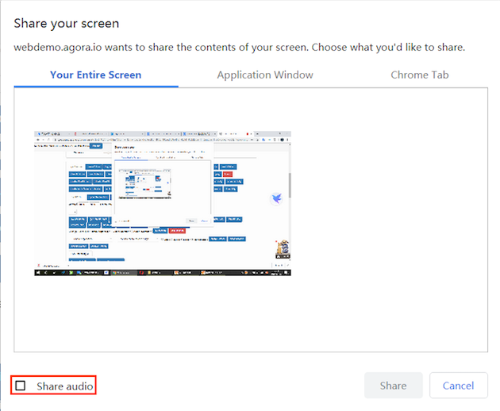
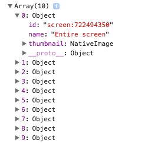
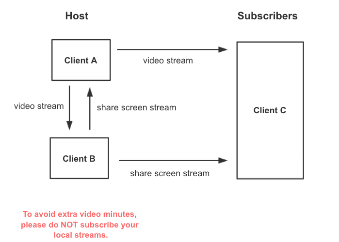

## Introduction

Screen sharing enables the host of a video call or interactive live streaming to display what is on their screen to other users in the channel. This function has many obvious advantages for communicating information, particularly in the following scenarios:

- In a video conference, the speaker can share a local image, web page, or full presentation with other participants.
- In an online class, the teacher can share slides or notes with students.

Before enabling screen sharing, ensure that you have implemented the basic real-time communication functions in your project. For details, see [Implement a Basic Video Call](basic_call.md).

## Working principles

You can enable screen sharing on the web client by calling [createScreenVideoTrack](/api/en/interfaces/iagorartc.html#createscreenvideotrack) to create a video track for screen sharing. The web browser asks you to select which screens to share.

In the Agora Web SDK NG, an `AgoraRTCClient` object can publish only one video track at a time. If you want to share your screen while sending the video captured by the camera, then you need to create two `AgoraRTCClient` objects: one for publishing the video track from the camera, and one for publishing the video track for screen sharing.

## Screen sharing on Google Chrome

### Screen sharing without the Google Chrome extension

To share the screen on Chrome, simply call [createScreenVideoTrack](/api/en/interfaces/iagorartc.html#createscreenvideotrack) to create a video track for screen sharing.

> This function requires Google Chrome 72 or later. Otherwise, use the Google Chrome extension provided by Agora to share the screen.

## Screen sharing on Google Chrome

### Screen sharing without the Google Chrome extension

To share the screen on Chrome, simply call [createScreenVideoTrack](/api/en/interfaces/iagorartc.html#createscreenvideotrack) to create a video track for screen sharing.

> This function requires Google Chrome 72 or later. Otherwise, use the Google Chrome extension provided by Agora to share the screen.

```js
AgoraRTC.createScreenVideoTrack({
  // Set the encoder configurations. For details, see the API description.
  encoderConfig: "1080p_1",
}).then(localScreenTrack => {
  /** ... **/
});
```

### Screen sharing with the Google Chrome extension

1. Add the [Google Chrome Extension for Screen Sharing](https://docs.agora.io/en/Interactive%20Broadcast/chrome_screensharing_plugin) provided by Agora.

2. Set the `extensionId` parameter when you create a video track for screen sharing.

```js
AgoraRTC.createScreenVideoTrack({
  extensionId: 'minllpmhdgpndnkomcoccfekfegnlikg',
}).then(localScreenTrack => {
  /** ... **/
});

```

### Share audio
The Agora Web SDK NG supports sharing the local audio playback when sharing a screen on Windows Chrome 74 or later. To share the audio, set the `withAudio` parameter as `enable` when calling [createScreenVideoTrack](/api/cn/interfaces/iagorartc.html#createscreenvideotrack).

This method returns a list containing a video track object for screen sharing and an audio track object.

```js
AgoraRTC.createScreenVideoTrack({
  encoderConfig: "1080p_1",
}, "enable").then([screenVideoTrack, screenAudioTrack] => {
  /** ... **/
});
```

> - Notes:
> - For the audio sharing to take effect, the end user must check **Share audio** on the pop-up window when sharing a screen.
> - Audio sharing is disabled when the end user shares a single application window.



## Screen sharing on Electron

To share the screen on Electron, you need to draw the UI for your users to select which screen or window to share. For quick integration, Agora provides a default UI.

### Use the Default UI
To use the default UI, directly call [createScreenVideoTrack](/api/en/interfaces/iagorartc.html#createscreenvideotrack).

```js
AgoraRTC.createScreenVideoTrack({
  encoderConfig: "1080p_1",
}).then(localScreenTrack => {
  /** ... **/
});
```

The default UI for screen source selection is as follows:


### Customize the UI

Follow these steps to customize the UI for screen source selection:
1. Call `AgoraRTC.getElectronScreenSources` to get the sources of the screens to share. The `sources` parameter is an array of the `source` objects. A `source` object contains the following properties of the screen source:



  - `id`: The `sourceId`.
  - `name`: The name of the screen source.
  - `thumbnail`: The thumbnail of the screen source.

```
AgoraRTC.getElectronScreenSources().then(sources => {
  console.log(sources);
})
```

2. Based on the properties of `source`, draw the UI (by HTML and CSS) for selecting the screen source to share. The following figure shows the properties' corresponding elements on the UI for screen source selection:


3. Get the `sourceId` of the source selected by the user.
4. Set `sourceId` when creating the video track for screen sharing.

``` javascript
AgoraRTC.createScreenVideoTrack({
  // Pass the sourceId of the source selected by the user.
  electronScreenSourceId： sourceId,
}).then(localScreenTrack => {
  /** ... **/
});
```

> - The `getScreenSources` method is a wrapper of `desktopCapturer.getSources` provided by Electron. See [desktopCapturer](https://electronjs.org/docs/api/desktop-capturer).
> - Only Electron requires the `sourceId` parameter.

## Screen sharing on Firefox

To share the screen on Firefox, you need to set the `screenSourceType` parameter when creating the video track for screen sharing:
- `screen`: Share the whole screen.
- `application`: Share all windows of an app.
- `window`: Share a specific window of an app.

```js
AgoraRTC.createScreenVideoTrack({
  screenSourceType: 'screen' // 'screen', 'application', 'window'
}).then(localScreenTrack => { /** ... **/ });
```

> Firefox on Windows does not support the `application` mode.

## Enable both screen sharing and video

An `AgoraRTCClient` object can publish only one video track at a time. For this reason, if you want to enable both screen sharing and video on one host, you need to create two `AgoraRTCClient` objects: one for publishing the video track from the camera, and one for publishing the video track for screen sharing.

```js
async function startScreenCall() {
  const screenClient = AgoraRTC.createClient({ mode: "rtc", codec: "vp8" });
  await screenClient.join("<TOKEN>", "<CHANNEL>");

  const screenTrack = await AgoraRTC.createScreenVideoTrack();
  await screenClient.publish(screenTrack);

  return screenClient;
}

async function startVideoCall() {
  const videoClient = AgoraRTC.createClient({ mode: "rtc", codec: "vp8" });
  await videoClient.join("<TOKEN>", "<CHANNEL>");

  const videoTrack = await AgoraRTC.createCameraVideoTrack();
  await videoClient.publish(videoTrack);

  return videoClient;
}

Promise.all([startScreenCall(), startVideoCall()]).then(() => { /** ... **/ });
```

> If two clients of a host subscribe to each other, extra charges incur.



Agora recommends that you save the returned `uid` when each client joins the channel. When the `user-published` event occurs, first check if the `uid` of the user who publishes the track belongs to a local client. If the answer is yes, do not subscribe to the track.

## Considerations
- An `AgoraRTCClient` object can publish only one video track at a time.
- Do not set the UID of the screen-sharing track to a fixed value. Tracks with the same UID will interfere with each other.
- **Do not subscribe to a locally published screen-sharing track**, else additional charges incur.
- Sharing the window of a QQ chat on Windows causes a black screen.